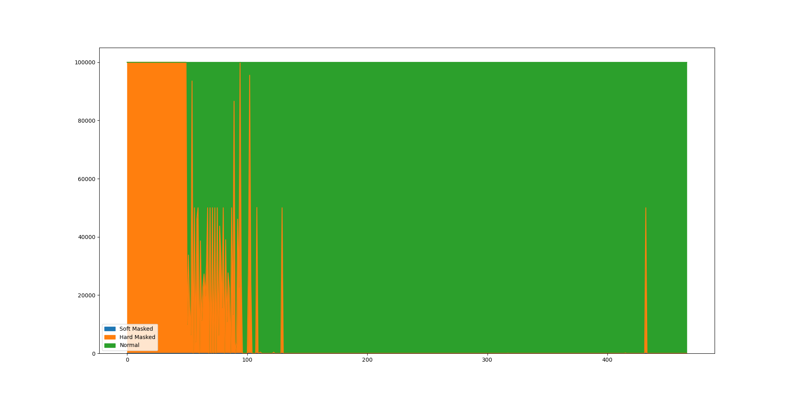
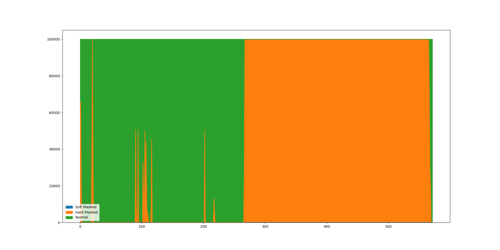

# GenCode

GenCode rather similar to Ensembl ones, but with different chromosome names.

The Toplevel Equivalent:

Example in chromosome 21:

Example in chromosome Y:

The Primary Assembly Equivalent:

Example in chromosome 21:

Example in chromosome Y:

