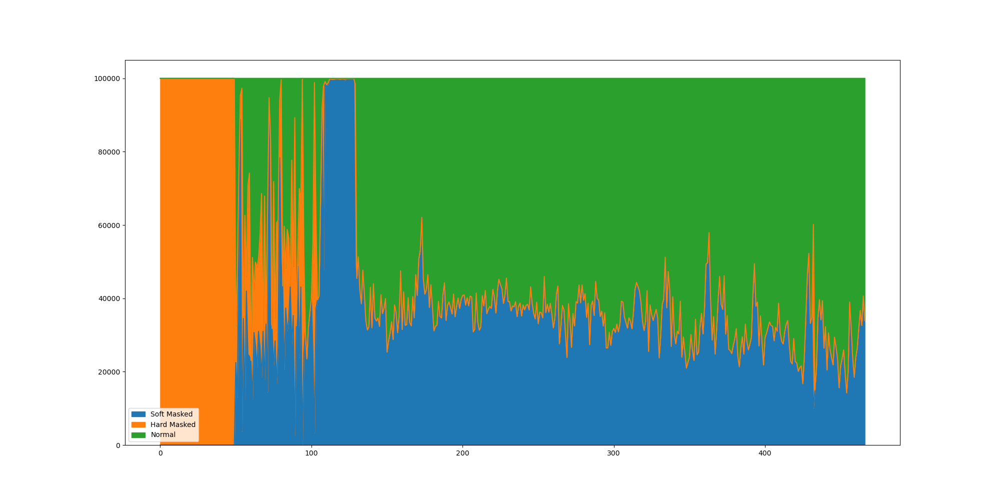
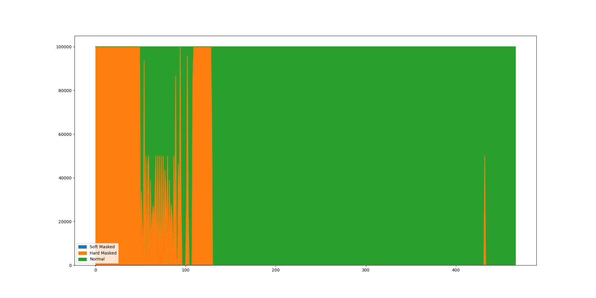
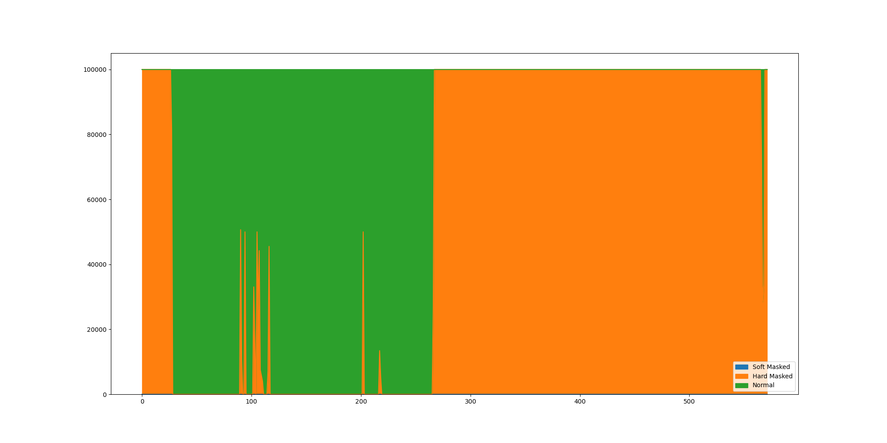

# Genomic Sequences from NCBI

## The International Human Genome Sequencing Consortium (IHGSC) version

The latest release is GRCh38 p14.

- GenBank assembly: [GCA_000001405.29](https://www.ncbi.nlm.nih.gov/assembly/GCF_000001405.40/)
- RefSeq assembly: [GCF_000001405.40](https://www.ncbi.nlm.nih.gov/assembly/GCF_000001405.40/)

Example in chromosome 21:

Example in chromosome Y:

Sample FASTA Index

| Contig Name    | Length    |
|----------------|-----------|
| NC_000001.11   | 248956422 |
| NT_187361.1    | 175055    |
| NT_187362.1    | 32032     |
| NT_187363.1    | 127682    |
| NT_187364.1    | 66860     |
| [...]          | [...]     |
| NT_187368.1    | 40745     |
| NT_187369.1    | 41717     |
| NC_000002.12   | 242193529 |
| NT_187370.1    | 161471    |
| NT_187371.1    | 153799    |
| NC_000003.12   | 198295559 |
| NT_167215.1    | 155397    |
| NC_000004.12   | 190214555 |
| NT_113793.3    | 209709    |
| [...]          | [...]     |
| NT_113889.1    | 161147    |
| NW_012132914.1 | 467143    |
| NW_015495298.1 | 278659    |
| [...]          | [...]     |
| NT_187687.1    | 170537    |
| NT_113949.2    | 177381    |
| NC_012920.1    | 16569     |

## GRCh38 Analysis Set

Example in chromosome 21:

Example in chromosome Y:

| Chromosome                 | Length    |
|----------------------------|-----------|
| chr1                       | 248956422 |
| [...]                      | [...]     |
| chr22                      | 50818468  |
| chrX                       | 156040895 |
| chrY                       | 57227415  |
| chrM                       | 16569     |
| chr1_KI270706v1_random     | 175055    |
| chr1_KI270707v1_random     | 32032     |
| [...]                      | [...]     |
| chrY_KI270740v1_random     | 37240     |
| chrUn_KI270302v1           | 2274      |
| chrUn_KI270304v1           | 2165      |
| [...]                      | [...]     |
| chrUn_GL000218v1           | 161147    |
| chr1_KI270762v1_alt        | 354444    |
| chr1_KI270766v1_alt        | 256271    |
| [...]                      | [...]     |
| chr19_KI270938v1_alt       | 1066800   |
| chrEBV                     | 171823    |
| chrUn_KN707606v1_decoy     | 2200      |
| [...]                      | [...]     |
| chrUn_JTFH01001998v1_decoy | 2001      |
