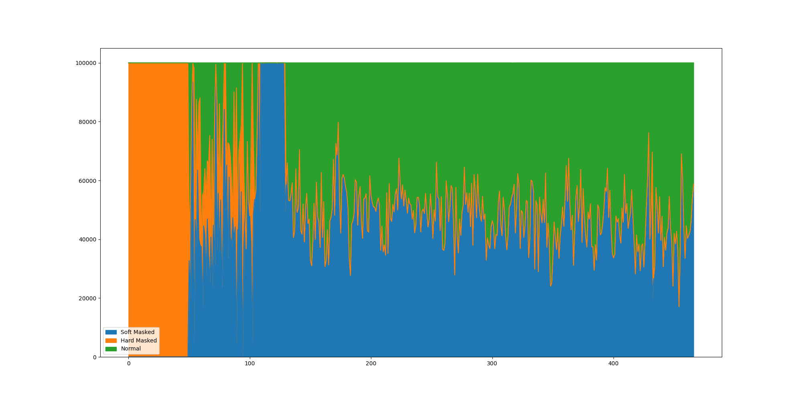
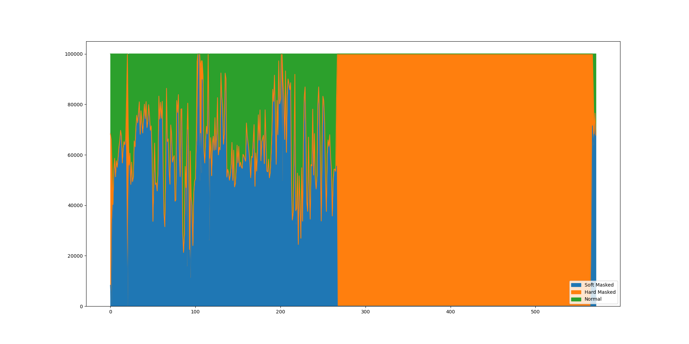
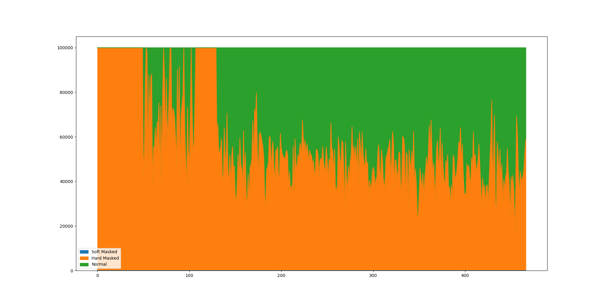
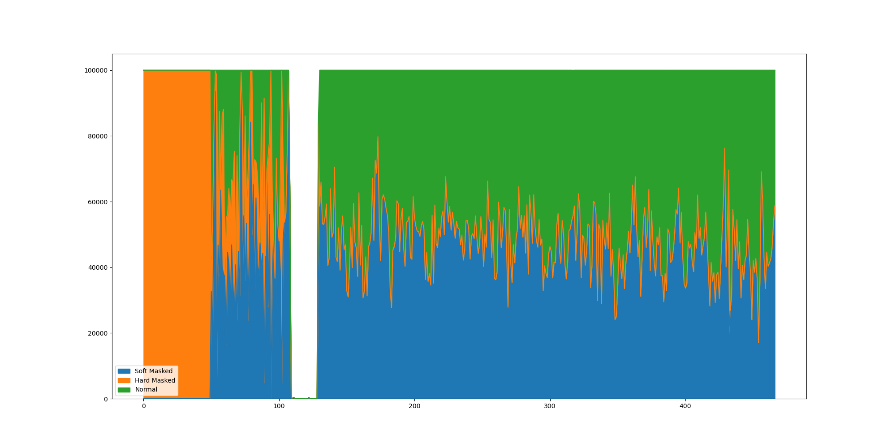
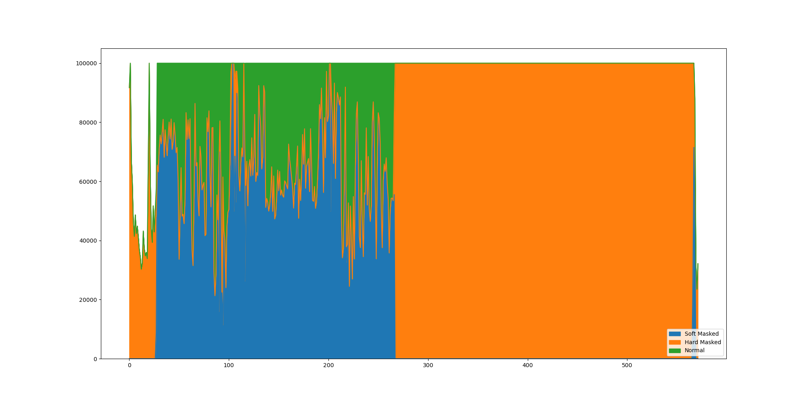

# Genomic Sequences from UCSC

## Original GRCh38.p13 Release

See: <https://hgdownload.soe.ucsc.edu/goldenPath/hg38/bigZips/latest/>

UCSC kindly provides a lookup reference to convert contig names at <https://hgdownload.soe.ucsc.edu/goldenPath/hg38/bigZips/p13/hg38.p13.chromAlias.txt>.

UCSC soft- or hard-masks regions masked by RepeatMasker or Tandem Repeats Finder using parameters different from NCBI ones.

Example in chromosome 21:

Example in chromosome Y:

There are also a hard-masked one:

Example in chromosome 21:

Example in chromosome Y:

## Analysis Set

See: <https://hgdownload.soe.ucsc.edu/goldenPath/hg38/bigZips/analysisSet/>

Have 195 contigs.

Example in chromosome 21:

Example in chromosome Y:

Sample FASTA Index:

| Contig Name            | Length    |
|------------------------|-----------|
| chr1                   | 248956422 |
| [...]                  | [...]     |
| chrX                   | 156040895 |
| chrY                   | 57227415  |
| chrM                   | 16569     |
| chr1_KI270706v1_random | 175055    |
| [...]                  | [...]     |
| chrY_KI270740v1_random | 37240     |
| chrUn_KI270302v1       | 2274      |
| [...]                  | [...]     |
| chrUn_GL000218v1       | 161147    |
| chrEBV                 | 171823    |
